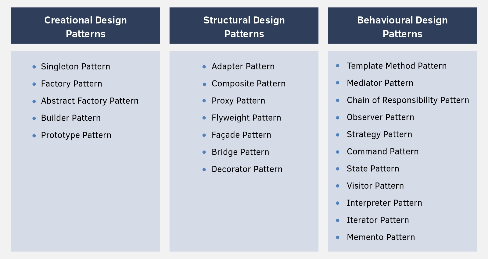

# Design Patterns in Java

Design patterns are design level solutions for recurring problems that are commonly faced in the software engineering
domain. In short, design patterns are well-described solution to common software problems.

Using design pattern is considered good practice. As the design of the solution is quite tried and tested, resulting in
higher readability of the final code.

There are about 26 design patterns currently discovered. All of them can be categorised mainly in 3 categories.

* **Creational Pattern**: These patterns are designed for class instantiation. They can be either class-creation
  patterns or object creational patterns.
* **Structural Pattern**: These patterns are designed with regard to a class's structure and composition. The main goal
  of most of these patterns is to increase the functionality of the classes involved, without changing much of its
  composition.
* **Behavioural Pattern**: These patterns are designed depending on how one class communicates with others.

# Creational Pattern

### Singleton Pattern

The Singleton Design Pattern is a creational pattern, whose objective is to create only one instance of a class and to
provide only one global access point to that object. These are characteristics of singleton pattern:

* Private constructor
* Ensures only one object creation of a particular class
* Has two variation. Lazy initialization and eager initialization
* Thread safe
